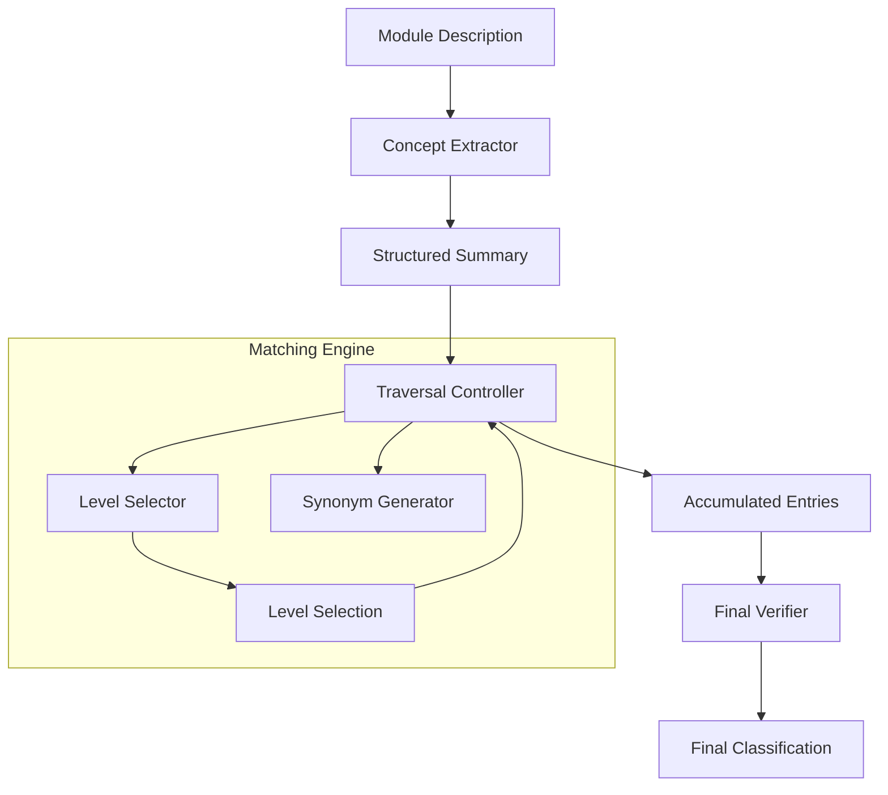

# ORACLE System Architecture

ORACLE (**O**ntology-based **R**ecursive **A**I-driven **C**lassification & **L**earning **E**ngine) is a modular framework designed to classify Higher Education module descriptions into complex, hierarchical ontologies (like MSC2020) using LLMs.

This document provides a technical overview for developers entering the codebase.

---

## 1. High-Level Architecture Overview

ORACLE follows a pipeline-based architecture where each stage is decoupled and can operate in either **Asynchronous (Parallel)** or **Synchronous (Sequential)** modes.



---

## 2. The `classify_module` Pipeline

The `classify_module` function (found in `oracle/cli/classify.py`) acts as the central orchestrator. It manages the flow of data through the components based on the `use_async` flag.

### Orchestration Steps:

1.  **Initialization**: Instantiates the LLM, `SynonymGenerator`, `ConceptExtractor`, `LevelSelector`, `TraversalController`, and `Verifier`.
2.  **Step 1: Concept Extraction**:
    *   **Async**: Calls `extractor.aextract_concepts()`.
    *   **Sync**: Calls `extractor.extract_concepts()`.
    *   *Result*: A `ConceptSummary` object.
3.  **Step 2: Ontology Traversal**:
    *   **Async**: Calls `controller.atraverse()`. This explores branches in parallel.
    *   **Sync**: Calls `controller.traverse()`. This explores branches sequentially.
    *   *Result*: A list of `LevelSelectionEntry` objects.
4.  **Step 3: Verification**:
    *   **Async**: Calls `verifier.averify_selection()`.
    *   **Sync**: Calls `verifier.verify_selection()`.
    *   *Result*: A `FinalClassification` object containing the final codes and unmatched topics.

---

## 3. Core Components

### 📂 `oracle.data` (The Knowledge Layer)
- **`BaseOntology`**: An abstract interface that defines how the matching engine interacts with hierarchy data (getting roots, children, nodes).
- **`MSCOntology`**: A concrete implementation for the Mathematics Subject Classification (MSC2020) that parses CSV sources.
- **`SynonymGenerator`**: An intelligence layer that uses LLMs to generate technical synonyms for ontology nodes, backed by a local JSON disk cache (`synonyms_cache.json`).

### 📂 `oracle.extract` (The Parsing Layer)
- **`ConceptExtractor`**: Uses a high-quality LLM prompt to transform raw, noisy module descriptions into a structured `ConceptSummary` (core topics, methods, applications, skills). This summary acts as the "source of truth" for all subsequent matching steps.

### 📂 `oracle.match` (The Intelligence Layer)
- **`TraversalController`**: The heart of the engine. It recursively navigates the ontology. In **Async Mode**, it uses `asyncio.gather()` to explore multiple relevant branches simultaneously.
- **`LevelSelector`**: Performs a "local" selection at a specific node level. It is **Path-Aware**, meaning it knows the classification history (e.g., `Root -> 35 -> 35A`) and injects this context into the LLM prompt for higher precision.

### 📂 `oracle.verify` (The Refinement Layer)
- **`Verifier`**: A final safety check. It takes the accumulated matches from all levels, deduplicates them, removes weak justifications, and identifies "unmatched topics" that the ontology couldn't cover. It uses OpenAI's **Structured Output** (`with_structured_output`) to ensure 100% JSON compliance.

---

## 3. Key Design Patterns

### 🔹 Dual-Mode Execution
ORACLE supports a `use_async` flag. 
- **Async (Default)**: Optimized for performance, using parallel LLM calls to explore the hierarchy.
- **Sync**: Best for debugging; logs appear in a clear, sequential order capturing the precise reasoning path.

### 🔹 Concurrency Control
To prevent overwhelming API endpoints or credit limits, the `TraversalController` uses an **`asyncio.Semaphore`** (default limit: 5). This ensures that even in deep, wide ontologies, no more than 5 LLM requests are active at once.

### 🔹 Resilience & Self-Healing
LLM calls are wrapped in `tenacity` retries via LangChain's `.with_retry()`. The system is designed to automatically recover from common network errors like `502 Bad Gateway` or `504 Gateway Timeout`.

---

## 4. Developer Workflow

### Adding a New Ontology
1. Inherit from `BaseOntology` in `oracle/data/`.
2. Implement `get_roots()`, `get_children()`, and `get_node()`.
3. Pass your new class to the `classify_module` orchestrator.

### Modifying LLM Behavior
- All prompts are centralized in `oracle/utils/prompts.py`.
- LLM configurations (model, temperature, timeout) are managed via Pydantic Settings in `oracle/config.py`.

### Running Verification
Always test both modes before committing core changes:
```bash
# Verify Parallel Performance
python scripts/run_example.py

# Verify Reasoning Logic (Sequential)
python scripts/run_example.py --no-async
```
